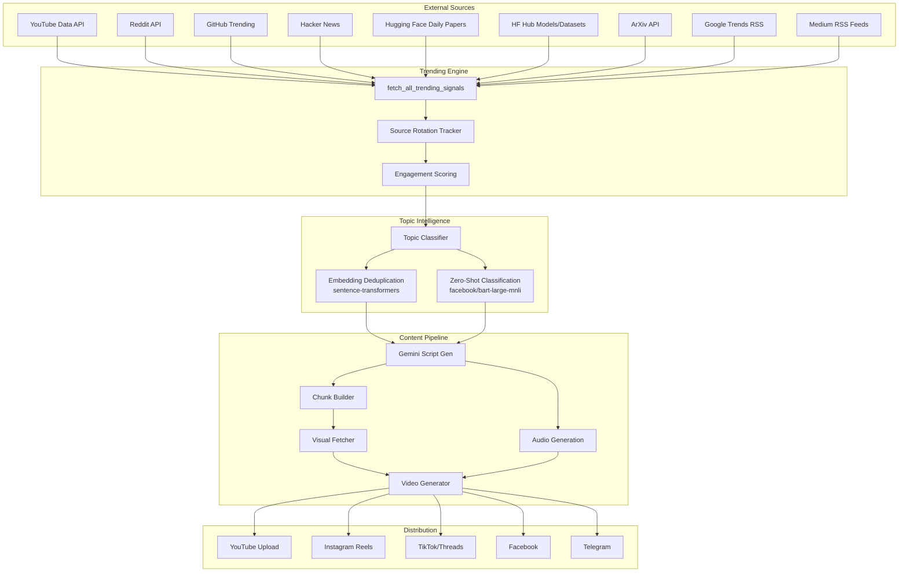
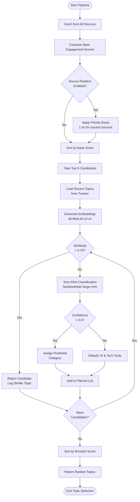
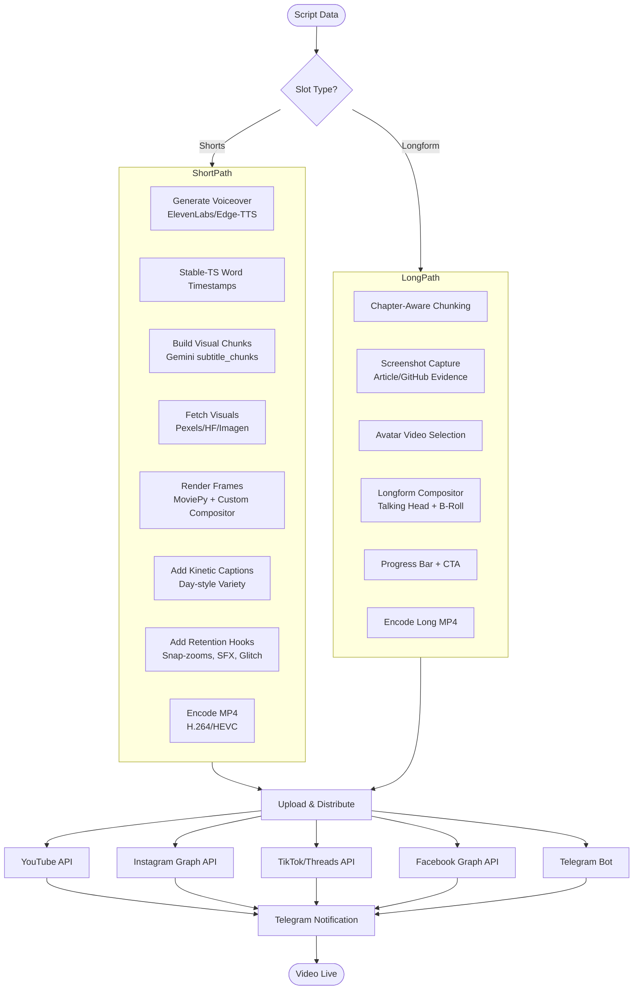
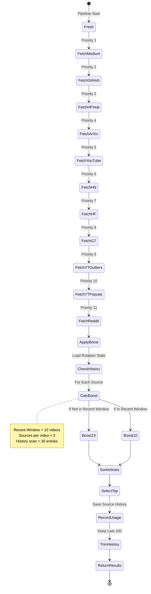
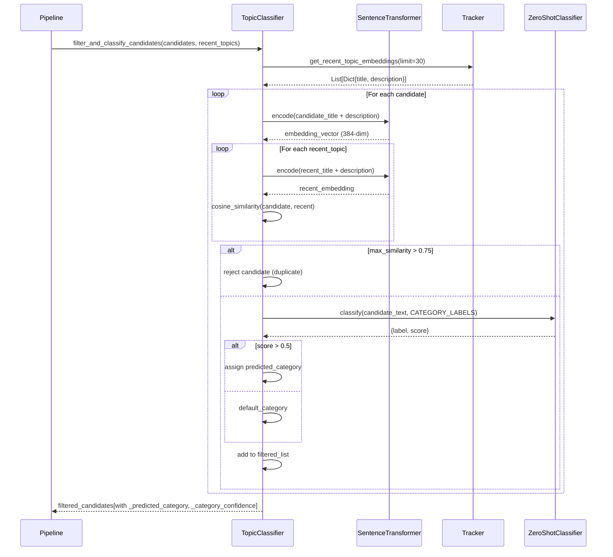
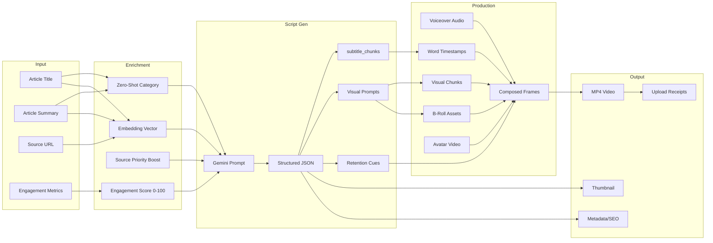
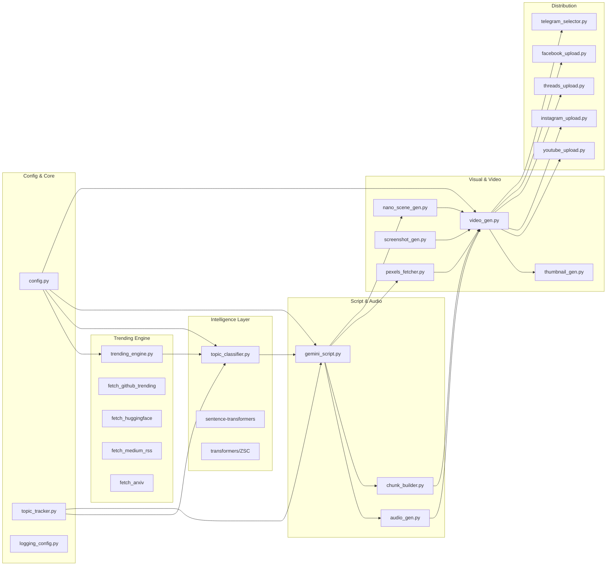
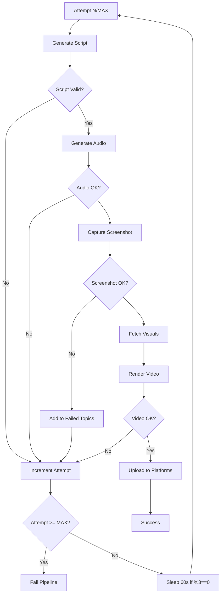
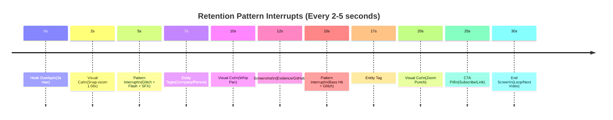

# YT Did You Know - Architecture & Flow Diagrams

## High-Level System Architecture



---

## Topic Selection & Classification Flow



---

## Video Generation Pipeline



---

## Source Rotation State Machine



---

## Embedding Deduplication Sequence



---

## Daily Schedule & Slot Allocation

```mermaid
gantt
    title Daily Production Schedule (4 Slots)
    dateFormat  HH:mm
    axisFormat %H:%M
    
    section Slot A (06:00 UTC)
    Trending Fetch     :a1, 06:00, 10m
    Topic Selection    :a2, after a1, 5m
    Script Gen         :a3, after a2, 3m
    Audio Gen          :a4, after a3, 2m
    Visual Fetch       :a5, after a4, 5m
    Video Render       :a6, after a5, 8m
    Upload             :a7, after a6, 3m
    
    section Slot B (12:00 UTC)
    Trending Fetch     :b1, 12:00, 10m
    Topic Selection    :b2, after b1, 5m
    Script Gen         :b3, after b2, 3m
    Audio Gen          :b4, after b3, 2m
    Visual Fetch       :b5, after b4, 5m
    Video Render       :b6, after b5, 8m
    Upload             :b7, after b6, 3m
    
    section Slot C (18:00 UTC) - Longform
    Trending Fetch     :c1, 18:00, 10m
    Topic Selection    :c2, after c1, 5m
    Longform Script    :c3, after c2, 10m
    Audio Gen          :c4, after c3, 5m
    Visual Fetch       :c5, after c4, 10m
    Video Render       :c6, after c5, 30m
    Upload             :c7, after c6, 5m
    
    section Slot D (00:00 UTC)
    Trending Fetch     :d1, 00:00, 10m
    Topic Selection    :d2, after d1, 5m
    Script Gen         :d3, after d2, 3m
    Audio Gen          :d4, after d3, 2m
    Visual Fetch       :d5, after d4, 5m
    Video Render       :d6, after d5, 8m
    Upload             :d7, after d6, 3m
```



---

## Data Flow: Article → Video



---

## Component Dependency Graph



---

## Error Handling & Retry Flow



---

## Retention Engine Visual Pattern



---

## Rendering: Viewing Diagrams

These diagrams use **Mermaid.js** syntax. To view them:

1. **VS Code**: Install "Markdown Preview Mermaid Support" extension
2. **GitHub/GitLab**: Native rendering in `.md` files
3. **Obsidian/Notion**: Paste directly
4. **Online**: https://mermaid.live
5. **CLI**: `npx -p @mermaid-js/mermaid-cli mmdc -i ARCHITECTURE.md -o diagrams/`

```bash
# Generate all diagrams as PNG/SVG
npm install -g @mermaid-js/mermaid-cli
mmdc -i docs/ARCHITECTURE.md -o docs/diagrams/ -b transparent
```